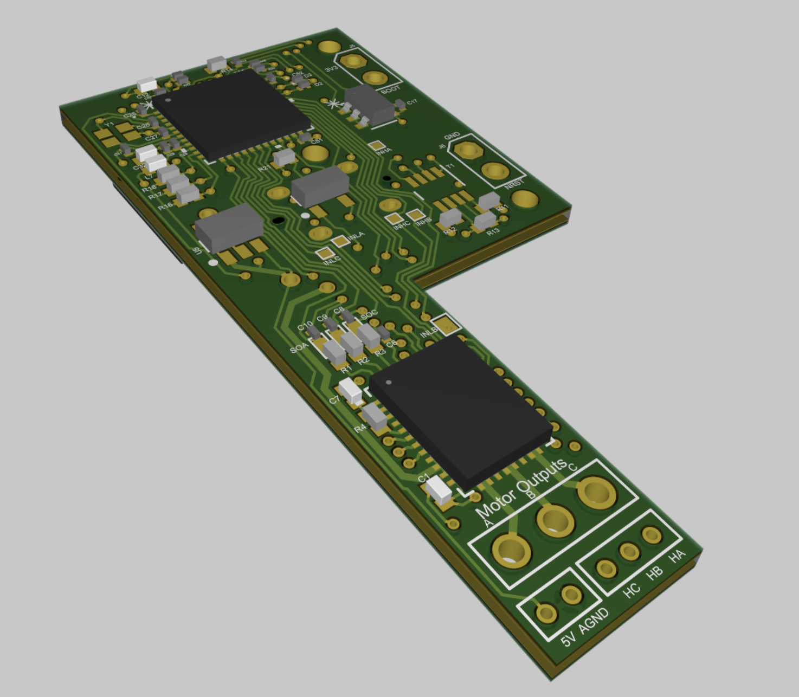

## Anubhav Saini

  

#### Hey! My name is Anubhav and I'm a **4th Year Engineering Physics Undergad** at UBC. My passions involve both hardware and software design and I am keen on working in fields like robotics, AI, aerospace, and automotive development.

---
## Here is a link to my Resume:

  <a href="docs/assets/Resume - Anubhav Saini.pdf" target="_blank" style="color: black; text-decoration: none; font-size: 0.9em;">
    📄 <strong> My Resume</strong>
  </a>

___

## Please scroll down to see some of my Featured Projects:

#### Click on any project's title or icon to get a detailed description!

  <a href="/SarcoSensor/" style="text-decoration: none; color: black;">
    
    <h3 style="color:black; margin: 0; font-size:0.9em">Fingertip Magnetic Force Sensor</h3>
  </a>

  <a href="/MetalMario/" style="text-decoration: none; color: black;">
    
    <h3 style="color:black; margin: 0; font-size:0.9em">Metal Mario: Autonomous Robot Car</h3>
  </a>

  <a href="/MLrobot/" style="text-decoration: none; color: black;">
    
    <h3 style="color:black; margin: 0; font-size:0.9em">Machine Learning Robot Detective</h3>
  </a>

  <a href="/SarcoPCB/" style="text-decoration: none; color: black;">
    
    <h3 style="color:black; margin: 0; font-size:0.9em">Motor Control PCB</h3>
  </a>

  <a href="/MicrochipMultithread/" style="text-decoration: none; color: black;">
    
    <h3 style="color:black; margin: 0; font-size:0.9em">Multithreaded Test Routine</h3>
  </a>

  <a href="/UasBuckConvertor/" style="text-decoration: none; color: black;">
    
    <h3 style="color:black; margin: 0; font-size:0.9em">Buck Convertor Circuit</h3>
  </a>

  <a href="/UASantenna/" style="text-decoration: none; color: black;">
    
    <h3 style="color:black; margin: 0; font-size:0.9em">UAS Antenna Tracker</h3>
  </a>

---
