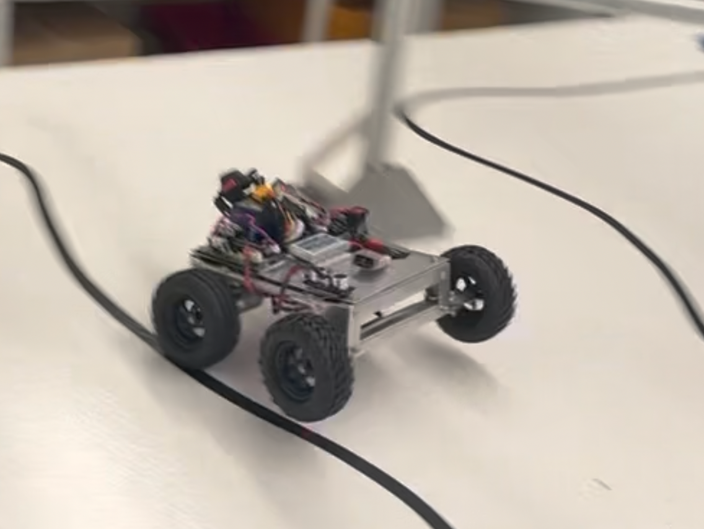

## Anubhav Saini

  

#### Hey! My name is Anubhav and I'm a **4th Year Engineering Physics Undergad** at UBC. My passions involve both hardware and software design and I am keen on working in fields like robotics, AI, aerospace, and automotive development.

---
## Here is a link to my Resume:

  <a href="docs/assets/Resume - Anubhav Saini.pdf" target="_blank" style="color: black; text-decoration: none; font-size: 0.9em;">
    📄 <strong> My Resume</strong>
  </a>

___

## Here are some of my Featured Projects:

  <a href="/MetalMario/" style="text-decoration: none; color: black;">
    
    <h3 style="color:black; margin: 0; font-size:0.9em">Metal Mario: Autonomous Robot Car</h3>
  </a>

  <a href="/MLrobot/" style="text-decoration: none; color: black;">
    
    <h3 style="color:black; margin: 0; font-size:0.9em">Machine Learning Robot Detective</h3>
  </a>

---
